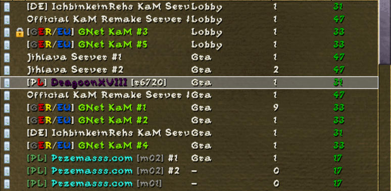
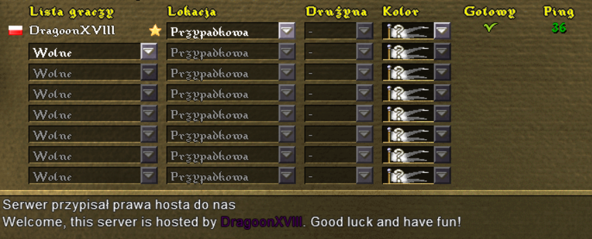

# KaM Remake Server Hosting Tutorial

This is a quick guide to hosting a **KaM Remake dedicated server**.

## About Knights and Merchants Remake

KaM Remake is a modification aiming to modernize and revitalize the classic real-time strategy game *Knights and Merchants: The Shattered Kingdom*.  
To run KaM Remake, you need a legally obtained copy of the original game (e.g., from GOG).

### Useful links:

- [Official website](https://www.kamremake.com/download/)
- [Buy the original game on GOG](https://www.gog.com/pl/game/knights_and_merchants_the_peasants_rebellion)
- [KaM Remake Discord server](https://discord.gg/DeSNQcbeTe)
- [KaM Remake GitHub](https://github.com/reyandme/kam_remake/)

## About the Server

> “The dedicated server is not required to play multiplayer. Clicking ‘Start Local Server’ or ‘Start Internet Server’ from the network menu has the same effect, except you must participate in the game and the server cannot be left to maintain itself. The dedicated server is only necessary if you want to provide a server without playing. The main purpose of the dedicated server is to allow servers to be hosted 24/7, which players can join and participate in any time they like. If you are able to provide this service we would be pleased.”  
> — from [kamremake.com/about](https://www.kamremake.com/about/)

## Requirements

- Any Linux / Windows system (x86, x86_64)
- Server executables are available on: https://github.com/reyandme/kam_remake/tags
- Open port `56789` (default)

## Linux

### 1. Opening the Port

Ensure that **port `56789` is open** on your system firewall **and** on your router (if you're hosting on a bare-metal machine), or in your cloud provider's security group/firewall (e.g., Oracle Cloud).

Example using `iptables`:

```bash
sudo iptables -I INPUT -p tcp --dport 56789 -j ACCEPT
```

>**Important:** Be sure to persist your firewall rules. Some cloud providers (e.g., Oracle, AWS) may reset `iptables` rules on reboot, which would block incoming connections to your KaM server.

---

### 2. Running the Server

With the port open and the server binary downloaded, you can launch the KaM Remake server executable directly from the parent directory:

```bash
./KaM_Remake_Server
```

> **Important:** Make sure the server binary is executable. You can add execution permissions with: `chmod +x ./KaM_Remake_Server`


If everything is set up correctly, your server should now appear on the multiplayer server list in the KaM Remake client.

---

### 3. Testing the Server

To verify the server is working:
- Connect using a **KaM Remake client of the same version** as the server.
- If version mismatch occurs, the client may not detect the server or will fail to connect.

---

### 4. Docker (Optional)

If you're a fan of containerized environments, you can easily run the KaM Remake server using Docker.
Example files (Dockerfile and docker-compose.yml) are provided in this repository.

To build and start the server:

```bash
docker compose up --build -d
```
This will launch the server in a background container and ensure it restarts automatically if the system reboots or the container crashes.

> **Important:** While minimal base images (e.g., alpine) were tested, they lack several dynamically linked libraries required by the server binary.
As a result, the Docker image is based on ubuntu:latest for maximum compatibility.


## Customization

All server customization is done through an `.ini` file, created automatically in the same directory as the server binary upon first launch. The name of this file may vary depending on the server version.

Two commonly used fields are:

- `ServerName`
- `WelcomeMessage`

These fields support color formatting using a simple markup: `[$BBGGRR] Your text here[]`. `[$BBGGRR]` where BB is hex value for blue component, GG - hex for green and RR hex for red. [] ends the color and reverts to default white.
Note that the color code uses a **reversed RGB format (BGR)**.

### Example:

```ini
ServerName=[P[$0000FF]L[]] [$520044]DragoonXVIII[]
WelcomeMessage=Welcome, this server is hosted by [$520044]DragoonXVIII[]. Good luck and have fun!
```

### Result:





## Legal
This tutorial is unofficial and not affiliated with the KaM Remake development team.
Use at your own risk. I take no responsibility for any actions or consequences arising from the use of this guide or the hosted server.
